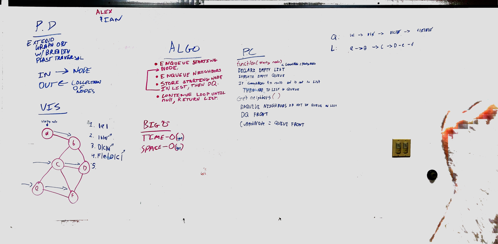

# Graph: Breadth First
* [Repo](https://github.com/alex-white-401-advanced-javascript/data-structures-and-algorithms/tree/insertion-sort/code-challenges/graph/breadth-first)
* [PR](https://github.com/alex-white-401-advanced-javascript/data-structures-and-algorithms/pull/20)

## Challenge
Extend your graph object with a breadth-first traversal method that accepts a starting node. Without utilizing any of the built-in methods available to your language, return a collection of nodes in the order they were visited. Display the collection.

## Approach & Efficiency
* Utilized the Single-responsibility principle
* Code is efficient, clean, and testable

### Author: Alexander White & Ian Gifford

### UML

