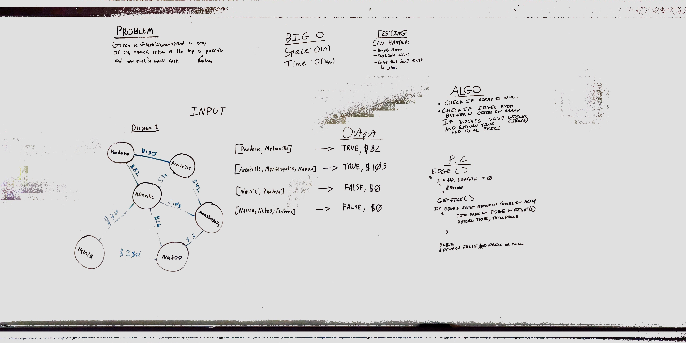

# Graph
* [Repo](https://github.com/alex-white-401-advanced-javascript/data-structures-and-algorithms/tree/insertion-sort/code-challenges/graph/getEdge)
* [PR](https://github.com/alex-white-401-advanced-javascript/data-structures-and-algorithms/pull/22)

## Challenge
Write a function based on the specifications above, which takes in a graph, and an array of city names. Without utilizing any of the built-in methods available to your language, return whether the full trip is possible with direct flights, and how much it would cost.

## Approach & Efficiency
* Utilized the Single-responsibility principle
* Code is efficient, clean, and testable

### Author: Alexander White

### UML

